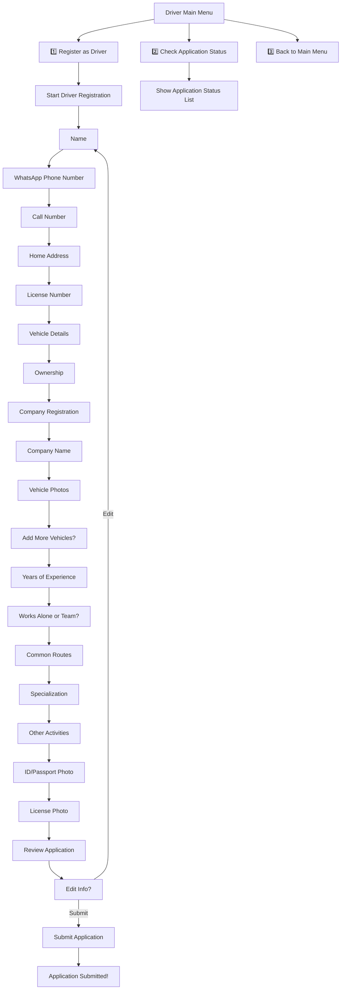

# Driver Application Flow Documentation

## Summary

The Driver Application Flow allows users to register as drivers, check the status of their applications, and manage their driver profile via WhatsApp. The process is comprehensive and user-friendly.

## Flow Diagram

## Step-by-Step Breakdown

1. **Main Menu**: User chooses to register as a driver, check application status, or return to the main menu.
2. **Register as Driver**: User is guided through a comprehensive registration process:
   - Name, phone, call number, address, license, vehicle details, ownership, company info, photos, experience, team, routes, specialization, other activities, document uploads, review, and submit.
3. **Check Application Status**: User can view a list of all their applications and their statuses.

## Future Expansion

- FAQ
- Troubleshooting
- User tips
