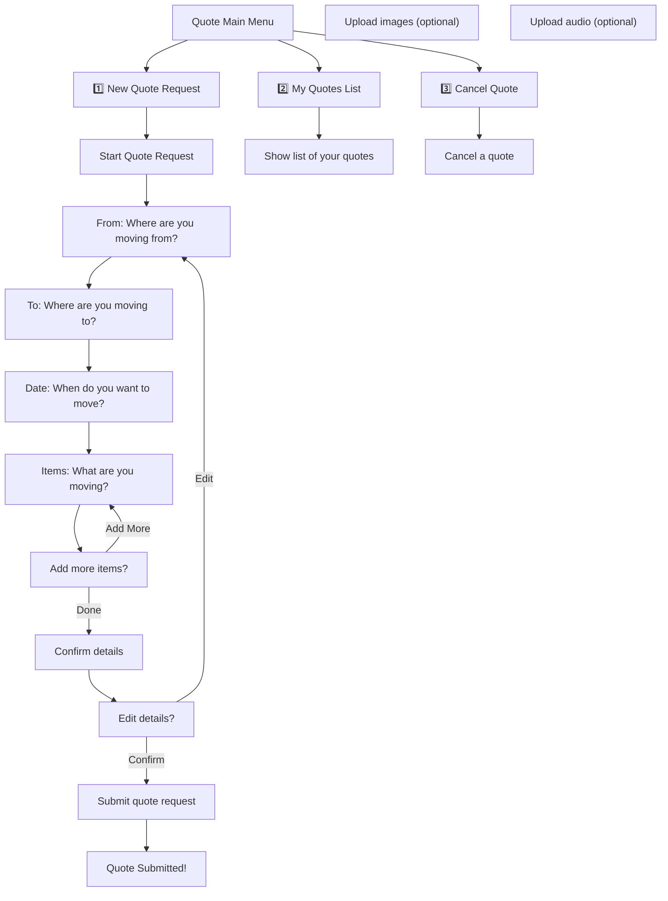

# Quote Flow Documentation

## Summary

The Quote Flow guides users through requesting a moving quote, viewing their quotes, or cancelling a quote via WhatsApp. It features an enhanced multi-item collection system with progress tracking and clear user control.

## Flow Diagram

## Step-by-Step Breakdown

1. **Main Menu**: User chooses to start a new quote, view their quotes, or cancel a quote.
2. **New Quote Request**: User is guided through a series of questions:
   - Where are you moving from?
   - Where are you moving to?
   - When do you want to move?
   - **Enhanced Items Collection**:
     - User can upload multiple items (photos, videos, documents, text)
     - Progress tracking shows how many items collected
     - Option to add more items or finish after each upload
     - Clear instructions for each media type
   - Confirm and edit details if needed.
   - Submit the quote request.
3. **My Quotes List**: User can view a list of their submitted quotes with proper formatting and navigation.
4. **Cancel Quote**: User can cancel an existing quote.

## Enhanced Features

### Multi-Item Collection

- **Progress Tracking**: Shows "X items collected" after each upload
- **Multiple Media Types**: Support for photos, videos, documents, audio, and text
- **User Control**: Clear "Add More" vs "Done" options
- **Item Preview**: Shows all collected items in the final summary

### Improved UX

- **Clear Instructions**: Specific guidance for each media type
- **Progress Indicators**: Visual feedback on collection progress
- **Flexible Flow**: Users can add as many items as needed
- **Easy Navigation**: Simple 1/2 choice for continue/finish

## Future Expansion

- FAQ
- Troubleshooting
- User tips
- Item editing/removal options
